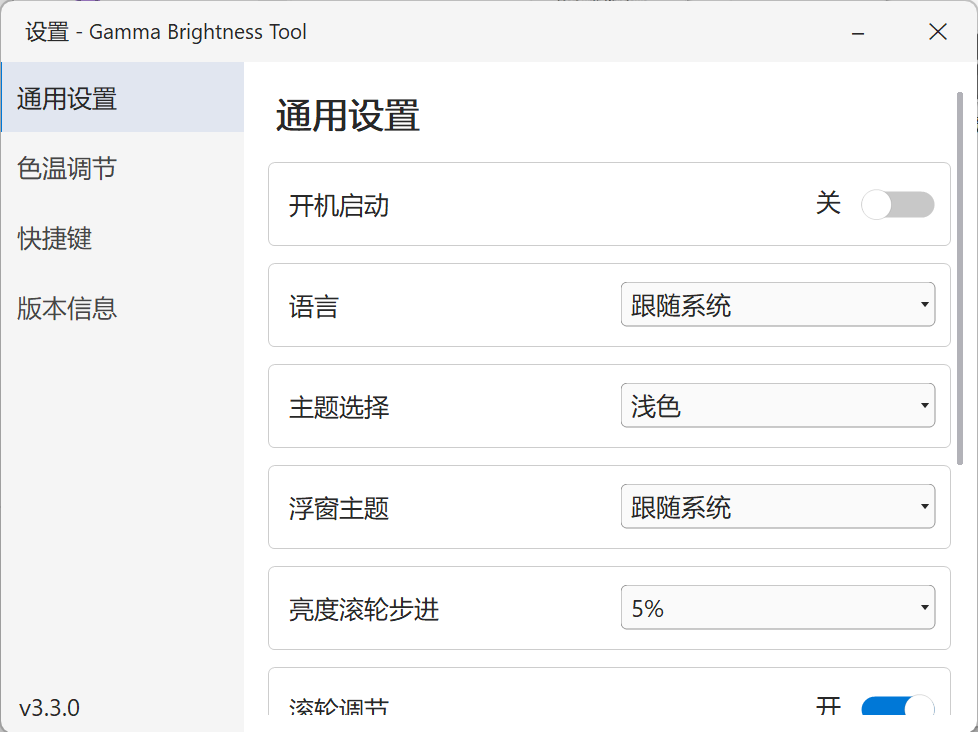
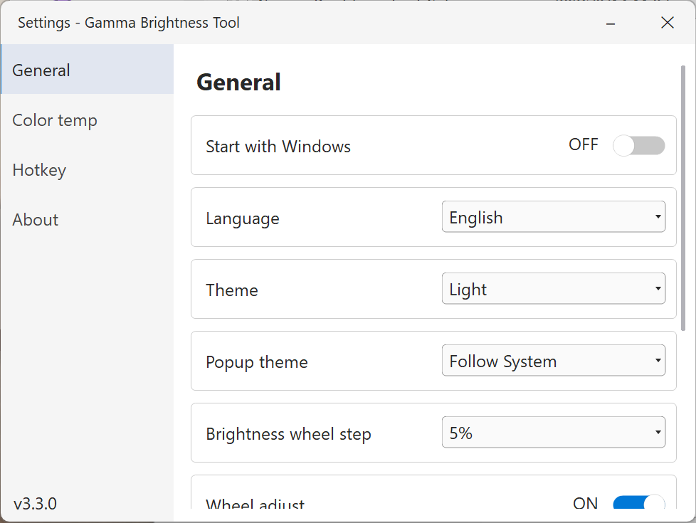
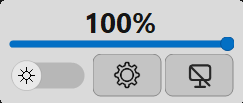
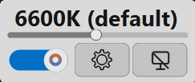
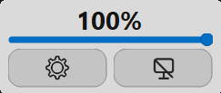

# GammaBrightnessTool

English | [中文](#中文版--gammabrightnesstool)

A Windows screen brightness & color temperature adjustment tool built on .NET 8 / WinForms. It adjusts the display via Gamma Ramp (`SetDeviceGammaRamp`), lives in the system tray, and supports quick wheel-based adjustment.

💡 What it is: a lightweight utility for Windows environments where DDC/CI is unavailable (e.g. desktop PCs, VGA/HDMI setups, monitors that don't expose DDC/CI). It lives in the system tray and supports mouse wheel brightness adjustment out of the box. No special hardware or drivers required.

🌐 Languages: Simplified Chinese, Traditional Chinese, English, Japanese, Korean, German, French, Spanish, Russian.

## 📦 Version History

| Version | Release Notes | Source |
|---------|---------------|--------|
| **3.3.0 (Latest)** | Color temperature adjustment | [3.3.0/](3.3.0/README.md) |
| 3.2.0 | Global hotkeys | [3.2.0/](3.2.0/README.md) |
| 3.1.0 | Basic settings window + dark theme | — |
| 3.0.0 | Base version for brightness adjustment | [3.0.0/](3.0.0/README.md) |

### ✨ Feature evolution

| Feature | 3.0.0 | 3.1.0 | 3.2.0 | 3.3.0 |
|---------|:-----:|:-----:|:-----:|:-----:|
| Settings window | — | ✔ | ✔ | ✔ |
| Theme switching | — | ✔ | ✔ | ✔ |
| Global hotkeys | — | — | ✔ | ✔ |
| Color temperature | — | — | — | ✔ |

## 📸 Screenshots

| Settings (Chinese) | Settings (English) |
|--------------------|--------------------|
|  |  |

| Left-click popup — brightness | Left-click popup — color temp | Left-click popup — default |
|-------------------------------|-------------------------------|----------------------------|
|  |  |  |

## 🚀 Quick Start

Latest version (3.3.0): see [3.3.0/README.md](3.3.0/README.md) for full features, usage, and build instructions.

## 🖱️ Show the tray icon

If the app icon is not visible in the system tray:

- Open Settings → Personalization → Taskbar
- Click "Other system tray icons"
- Turn on the toggle for GammaBrightnessTool

## 📜 License

MIT License © 2026 GammaBrightnessTool Contributors. See [3.3.0/LICENSE](3.3.0/LICENSE).

---

# 中文版 | GammaBrightnessTool

[English](#gammabrightnesstool) | 中文

一个基于 .NET 8 / WinForms 的 Windows 屏幕亮度与色温调节工具。通过 Gamma Ramp（SetDeviceGammaRamp）调节显示器，常驻系统托盘，支持鼠标滚轮快捷调节。

💡 简介：一款简易的小工具，专为无法使用 DDC/CI 的 Windows 电脑环境（如台式机、VGA/HDMI 连接、不暴露 DDC/CI 的显示器）提供亮度调节能力。常驻系统托盘，支持鼠标滚轮快捷调节。无需特殊硬件或驱动，即可获得简单直观的屏幕亮度控制。

🌐 支持语言：简体中文、繁体中文、英语、日语、韩语、德语、法语、西班牙语、俄语。

## 📦 版本历史

| 版本 | 发布说明 | 源码 |
|------|----------|------|
| **3.3.0（最新）** | 色温调节 | [3.3.0/](3.3.0/README.md) |
| 3.2.0 | 全局快捷键 | [3.2.0/](3.2.0/README.md) |
| 3.1.0 | 添加基础设置窗口 + 深色主题 | — |
| 3.0.0 | 亮度调节的基础可用版本 | [3.0.0/](3.0.0/README.md) |

### ✨ 功能演进

| 功能 | 3.0.0 | 3.1.0 | 3.2.0 | 3.3.0 |
|------|:-----:|:-----:|:-----:|:-----:|
| 设置窗口 | — | ✔ | ✔ | ✔ |
| 主题切换 | — | ✔ | ✔ | ✔ |
| 全局快捷键 | — | — | ✔ | ✔ |
| 色温调节 | — | — | — | ✔ |

## 📸 界面截图

| 设置窗口（中文） | 设置窗口（英文） |
|------------------|------------------|
|  |  |

| 左键弹窗 — 亮度 | 左键弹窗 — 色温 | 左键弹窗 — 默认（色温关闭） |
|-----------------|-----------------|------------------------------|
|  |  |  |

## 🚀 快速开始

最新版（3.3.0）：完整功能、使用方法与编译说明见 [3.3.0/README.md](3.3.0/README.md)。

## 🖱️ 显示托盘图标

如果任务栏托盘里看不到软件图标：

- 打开 设置 → 个性化 → 任务栏
- 点击「其他系统托盘图标」
- 打开 GammaBrightnessTool 开关

## 📜 开源协议

MIT License © 2026 GammaBrightnessTool Contributors，详见 [3.3.0/LICENSE](3.3.0/LICENSE)。
