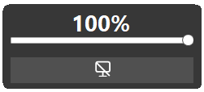

# GammaBrightnessTool

> **English** | [中文](#中文版--gammabrightnesstool)

A Windows screen brightness adjustment tool built on .NET 8 / WinForms. It adjusts monitor brightness via Gamma Ramp (`SetDeviceGammaRamp`), lives in the system tray, and supports quick wheel-based adjustment.

> 💡 **What it is**: a lightweight utility for Windows environments where **DDC/CI is unavailable** (e.g. desktop PCs, VGA/HDMI setups, monitors that don't expose DDC/CI). It lives in the **system tray** and supports **mouse wheel** brightness adjustment out of the box. No special hardware or drivers required.

> 🌐 **Languages**: Simplified Chinese, Traditional Chinese, English, Japanese, Korean, German, French, Spanish, Russian, and follow-system.

---

## 📦 Version History

| Version | Release Notes | Source |
|---------|---------------|--------|
| **3.2.0** (Latest) | Global hotkeys + dark/light theme + more settings options | [`3.2.0/`](3.2.0/README.md) |

Earlier versions (3.1.0: settings window + dark theme; 3.0.0: DPI overhaul) are archived and their source is no longer distributed.

### ✨ Feature evolution

| Feature | 3.0.0 | 3.1.0 | 3.2.0 |
|---------|:-----:|:-----:|:-----:|
| Settings window (non-modal, navigation pages) | — | ✔ | ✔ (more settings options) |
| Dark theme (window / tray menu / tray icon) | — | ✔ | ✔ |
| 9 languages + follow system | — | ✔ | ✔ |
| Independent popup theme (slider / OSD) | — | ✔ | ✔ |
| Real-time system theme listening | — | ✔ | ✔ |
| Global hotkeys (brightness up/down / screen off) | — | — | ✔ |
| Per-hotkey enable toggles + one-click clear all | — | — | ✔ |
| Wheel master switch / 9 step presets | — | — | ✔ |
| Reset settings (hotkeys kept) | — | — | ✔ |
| Settings window always-on-top toggle | — | — | ✔ |

## 📸 Screenshots

| OSD overlay (wheel) | Left-click popup |
|:---:|:---:|
|  |  |

## 🚀 Quick Start

**Latest version (3.2.0):** see [`3.2.0/README.md`](3.2.0/README.md) for full features, usage, and build instructions.

## 🖱️ Show the tray icon

If the app icon is not visible in the system tray:

1. Open **Settings** → **Personalization** → **Taskbar**
2. Click **Other system tray icons**
3. Turn **on** the toggle for **GammaBrightnessTool**

## 📜 License

MIT License © 2026 GammaBrightnessTool Contributors. See `3.2.0/LICENSE`.

---

# 中文版 | GammaBrightnessTool

> [English](#gammabrightnesstool) | **中文**

一个基于 .NET 8 / WinForms 的 Windows 屏幕亮度调节工具。通过 Gamma Ramp（`SetDeviceGammaRamp`）调节显示器亮度，常驻系统托盘，支持鼠标滚轮快捷调节。

> 💡 **简介**：一款简易的小工具，专为**无法使用 DDC/CI 的 Windows 电脑环境**（如台式机、VGA/HDMI 连接、不暴露 DDC/CI 的显示器）提供亮度调节能力。常驻系统托盘，支持鼠标滚轮快捷调节。无需特殊硬件或驱动，即可获得简单直观的屏幕亮度控制。

> 🌐 **支持语言**：简体中文、繁体中文、英语、日语、韩语、德语、法语、西班牙语、俄语，以及跟随系统。

## 📦 版本历史

| 版本 | 发布说明 | 源码 |
|------|---------|------|
| **3.2.0**（最新） | 全局快捷键 + 深色/浅色主题 + 更多设置选项 | [`3.2.0/`](3.2.0/README.md) |

更早的版本（3.1.0：设置窗口 + 深色主题；3.0.0：DPI 全面修复）已归档，源码不再分发。

### ✨ 功能演进

| 功能 | 3.0.0 | 3.1.0 | 3.2.0 |
|------|:-----:|:-----:|:-----:|
| 设置窗口（非模态，导航分页） | — | ✔ | ✔（更多设置选项） |
| 深色主题（设置窗口/托盘菜单/托盘图标） | — | ✔ | ✔ |
| 9 语言 + 跟随系统 | — | ✔ | ✔ |
| 浮窗独立主题（滑块/OSD） | — | ✔ | ✔ |
| 系统主题实时监听 | — | ✔ | ✔ |
| 全局快捷键（增亮/降亮/熄屏） | — | — | ✔ |
| 快捷键生效开关 + 一键清除 | — | — | ✔ |
| 滚轮总开关 / 9 档步进预设 | — | — | ✔ |
| 重置设置（快捷键保留） | — | — | ✔ |
| 设置窗口置顶开关 | — | — | ✔ |

## 📸 界面截图

| 滚轮浮窗（OSD） | 左键弹窗 |
|:---:|:---:|
|  |  |

## 🚀 快速开始

**最新版（3.2.0）：** 完整功能、使用方法与编译说明见 [`3.2.0/README.md`](3.2.0/README.md)。

## 🖱️ 显示托盘图标

如果任务栏托盘里看不到软件图标：

1. 打开 **设置** → **个性化** → **任务栏**
2. 点击 **其他系统托盘图标**
3. 打开 **GammaBrightnessTool** 开关

## 📜 开源协议

MIT License © 2026 GammaBrightnessTool Contributors，详见 `3.2.0/LICENSE`。
